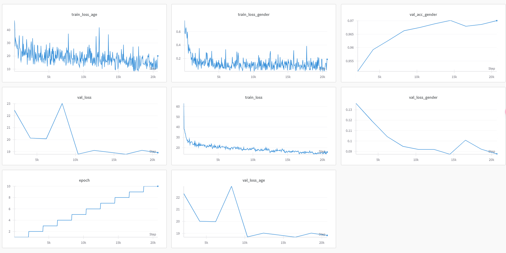

# AFAD 데이터셋 기반 나이/성별 예측 모델 학습 및 검증

## 개요
이 코드는 AFAD(Asian Face Age Dataset) 데이터셋을 사용하여 다중 작업(나이 예측 + 성별 분류) 모델을 학습하고 검증하는 스크립트입니다.

## 주요 기능
### 학습 (train.py)
- 다중 작업 학습
  - 나이 예측 (MSE Loss)
  - 성별 분류 (Cross Entropy Loss)
- Wandb를 통한 학습 모니터링
- 데이터 증강(Augmentation) 적용
- 학습률 스케줄러 지원
- 최적 모델 자동 저장

### 검증 (validate.py)
- 나이 예측 (회귀)
  - MAE(Mean Absolute Error) 계산
  - MSE Loss 계산
- 성별 분류
  - 정확도(Accuracy) 계산
  - Cross Entropy Loss 계산

## 필요 라이브러리
```python
torch
torchvision
timm
numpy
PyYAML
Pillow
tqdm
wandb
```

## 사용 방법
1. 설정 파일(config.yaml) 수정
```yaml
model:
  name: convnext_tiny  # 사용할 모델 아키텍처
training:
  epochs: 10          # 학습 에폭 수
  batch_size: 64      # 배치 크기
  lr: 1.0e-4         # 학습률
  weight_decay: 1.0e-5  # 가중치 감쇠
dataset:
  root_dir: /path/to/AFAD  # 데이터셋 경로
  image_size: 112    # 입력 이미지 크기
logging:
  use_wandb: true    # wandb 사용 여부
  project: "프로젝트명"
  entity: "사용자명"
```

2. 학습 실행
```bash
python train.py
```

3. 검증 실행
```bash
python validate.py
```

## 학습 출력 예시
```
[Epoch 1/10] Step 50/500 | Loss: 2.4567
[Epoch 1/10] Step 100/500 | Loss: 1.8901
...
=== Validation Epoch 1/10 ===
Val Loss: 1.7856 | Age Loss: 1.6789 | Gender Loss: 0.1067 | Gender Acc: 0.9234
Best model saved at epoch 1 with val_loss 1.7856
```

## 주요 기능 설명
### 데이터 증강
```python
train_transform = transforms.Compose([
    transforms.Resize((image_size, image_size)),
    transforms.RandomResizedCrop(image_size, scale=(0.8, 1.0)),
    transforms.RandomHorizontalFlip(p=0.5),
    transforms.RandomRotation(degrees=20),
    transforms.ColorJitter(brightness=0.2, contrast=0.2, saturation=0.2, hue=0.1),
])
```

### 학습률 스케줄러 옵션
```python
# 1. CosineAnnealingLR
scheduler = optim.lr_scheduler.CosineAnnealingLR(
    optimizer, T_max=epochs, eta_min=1e-6
)

# 2. ReduceLROnPlateau
scheduler = optim.lr_scheduler.ReduceLROnPlateau(
    optimizer, mode='min', factor=0.1, patience=3
)

# 3. OneCycleLR
scheduler = optim.lr_scheduler.OneCycleLR(
    optimizer, max_lr=lr, epochs=epochs, steps_per_epoch=len(train_loader)
)
```

## 학습결과




## 주의사항
- GPU 메모리 사용량에 따라 batch_size 조정 필요
- wandb 사용 시 로그인 필요
- 체크포인트 저장 공간 확보 필요
- 데이터셋 경로가 올바르게 지정되어 있는지 확인

## 참고사항
- 나이는 회귀 문제로 접근 (15-40세)
- 성별은 이진 분류 문제로 접근 (남성=0, 여성=1)
- 전체 데이터의 20%를 검증 데이터로 사용
- 학습 시에는 데이터 증강 적용, 검증 시에는 미적용

## 라이선스
- 이 코드는 MIT 라이선스 하에 배포됩니다.
- AFAD 데이터셋 사용 시 해당 라이선스를 확인해주세요.
